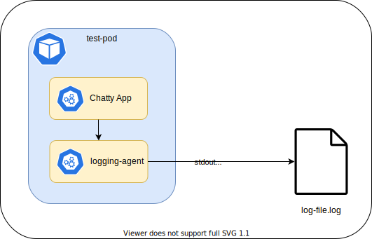
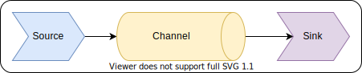
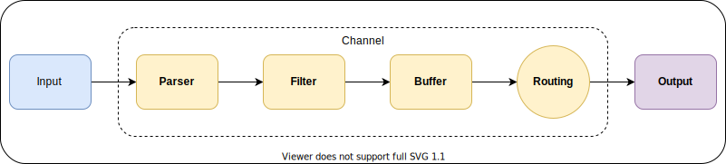
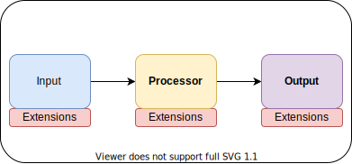

--8<-- "includes/abbreviations.md"

<div id="banner" class="page-image">
    
    <div class="page-image-caption">
        <p>
            <a href="https://flic.kr/p/tLtDWR">El Taller del Bit</a>
        </p>
    </div>
</div>

<!-- Reposition the banner image on top -->
<script>
    var article = document.getElementsByTagName("article")[0];
    article.insertBefore(document.getElementById("banner"), article.childNodes[0]);
</script>

# Agent Based Logging

*Posted by [Jason Bolden](../about.md) on Jul 25, 2021*


Whether you're working in site reliability, business intelligence, or security, one thing rings true. Logs are king. They are a window into your operations, providing insights into access, change, performance, who, what, when, where, and why. However, just as logs can be invaluable they can just as easily be burdensome and costly. Poor log hygiene plagues many organizations. While many business functions benefit from logs, they don't benefit from all logs and the excess translates directly to cost. In this post we'll explore some options for logging instrumentation that aid in filtering, routing, and maintaining the flow of logs at the host level.

## Objective
In this post we'll explore 3 popular logging agents to better understand the pros and cons of each solution for different scenarios. The contenders are:

 

Created in 2011, Fluentd is one of the most popular logging agents in the cloud computing space. The project was open-sourced in the same year, and Google supports their own flavor as their standard cloud logging agent. In 2014, Fluentbit was created as a lighter weight agent for IoT workloads.

 

NXLog was created back in 2009 as an alternative to msyslog. Originally a closed source project, NXLog Community Edition was open-sourced in 2011 and has been free since. NXLog has a reputation in the cybersecurity space as a windows event log collector. SANS' [SEC555](https://www.sans.org/cyber-security-courses/siem-with-tactical-analytics/) course references NXLog as a reliable free option for gaining visibility into windows and system logging.

 

Apache NiFi began as a project created by the NSA. It was later introduced to the Apache Software Foundation, and subsequently commercialized by Hortonworks (now [Cloudera](https://www.cloudera.com/)). The tool is a robust Data Flow Controller with the goal of making the automation and management of ETL processes simpler and more maintainable. MiNiFi is a sub-project that borrows the fundamental concepts defined by NiF, but packages them in a smaller form factor for deployment to endpoints and IoT devices.

We'll run through a basic deployment to a Windows desktop to demonstrate local setup and Kubernetes for cloud. In my personal experience, I've leveraged NiFi quite extensively. To be as objective as possibly in our evaluation, we'll measure each tool according to the following criteria:

- `Documentation` - This will be judged on completeness, number of examples, and searchability
- `Ease of Use` - How short is the time to get up and running, does the agent support monitoring, is it easy to maintain?
- `Cloud Readiness` - What cloud providers are supported? Does the documentation describe cloud installation?
- `Architecture` - How well is the agent designed, how resilient is it to operational disruption, can the base functionality be easily extended?

For the sake of time, evaluating ease of use and documentation will be based on my ability to set up the agents after 30 minutes of reading the documentation. The following Figures depict our lab setup.

<figure>
  
  <figcaption>Figure 1 - Conceptual Local Setup</figcaption>
</figure>

<figure>
  
  <figcaption>Figure 2 - Conceptual Cloud Setup</figcaption>
</figure>

All configurations and scripts for this post can be found in this [GitHub repo](https://github.com/jbold569/logging-agent-eval).

!!! tip
    When investigating multiple tools that solve the same problem, it's always a good idea to use time boxes. While 30 minutes is a bit extreme, it's not uncommon to dedicate a day to hacking out an MVP to assess the feasibility of using one solution over another.

## The Breakdown

Logging agents typically follow a 3 part architecture. `Source`, defines how the agent interfaces with the log producing system. `Channel`, a transport layer. Data are stored, transformed, and/or filtered in this layer. Lastly, `Sink` defines the interface with the destination of the data. As we describe the architecture of the three Solutions, we'll tie their components back to these three constructs for consistency and ease of comparison.

<figure>
  
  <figcaption>Figure 3 - Conceptual 3 part architecture for logging agents</figcaption>
</figure>

!!! note
    The astute would recognize this terminology from the [Apache Flume](https://flume.apache.org/) project. This was the first logging agent I used in a production setting. Many projects have sprung up since, but their underlying architecture remains more or less the same.

We'll also be using this short python script to produce our applications logs in each test.
```python
from datetime import datetime
import time, socket, sys

while True:
    with open(sys.argv[1], 'a') as f:
        f.write(f'{datetime.now():%Y-%m-%dT%H:%M:%S} {socket.gethostname()} Hello, World!\n')
        f.close()
    time.sleep(2)
```

This script is used in both the Local and Cloud setups. The following is the `Dockerfile` definition for our chatty-app.
```docker
FROM python:3.8-slim-buster

WORKDIR /app

COPY log-gen.py log-gen.py

CMD ["python3", "log-gen.py", "/var/log/log-file.log"]
```

[Minikube](https://minikube.sigs.k8s.io/docs/start/) and [Docker](https://hub.docker.com/search?q=&type=edition&offering=community&sort=updated_at&order=desc) should be installed on your machine if you intend to follow along. `chatty-app` must be built with the minikube environment variables set beforehand.
```bash
minikube start
eval $(minikube docker-env)
cd logging-agent-eval/cloud
docker build --tag chatty-app .
docker images
```

### Fluentbit
Fluentbit doesn't deviate much from our established formula. Configuration of the agent boasts a simplistic [format and schema](https://docs.fluentbit.io/manual/administration/configuring-fluent-bit/format-schema), utilizing `Sections` and indented key/value paired `Entries`

<figure>
  
  <figcaption>Figure 4 - Fluentbit Data Pipeline Model</figcaption>
</figure>

#### 30 Minute Sprint
After 30 minutes of combing the documentation, I felt pretty comfortable to start hacking away at an MVP. The docs are organized using [GitBook](https://www.gitbook.com/), making it fairly painless to navigate. If I had to be nit-picky, there's quite a few grammatical errors throughout. It's not unreadable, but it does throw one off a bit.

Concerning the bells and whistles, [security](https://docs.fluentbit.io/manual/administration/security) is supported through the use of TLS. All `outputs` that require network I/O support options for TLS configuration. Agents are resilient through the use of [buffering](https://docs.fluentbit.io/manual/administration/buffering-and-storage), enabling persistance to disk. Agent health can be [monitored](https://docs.fluentbit.io/manual/administration/monitoring) via API calls when configured. Alternatively, one could use the [Prometheus Exporter](https://docs.fluentbit.io/manual/pipeline/outputs/prometheus-exporter) output plugin to route monitoring metrics directly to a prometheus server.  [configuration](https://docs.fluentbit.io/manual/administration/configuring-fluent-bit/configuration-file).

Fluentbit also has a handy [visualizer](https://cloud.calyptia.com/#/visualizer) to aid in flow development. This can be very useful when troubleshooting complex dataflows.

!!! attention
    Take care with buffering strategies on cloud workloads. Due to the ephemeral nature of container resources, one should ensure the Fluentbit storage paths point to persistent volumes in your K8S deployment.   
#### Local Setup
After downloading the [ZIP archive](https://docs.fluentbit.io/manual/installation/windows#installing-from-zip-archive) for windows, create two new `*.conf` files to save the following settings:

- `fluent-bit.conf` defines our data flow. 
    ```fluentbit
    [SERVICE]
        flush        5
        daemon       Off
        log_level    info
        parsers_file parsers.conf

    [INPUT]
        name tail
        tag  log_file
        path ../log-file.log
        parser custom

    [INPUT]
        name winlog
        tag win_log
        channels Security
        Interval_Sec 1
        db winlog.sqlite 
        
    [OUTPUT]
        name  tcp
        match *
        host 127.0.0.1
        port 8514
        format json_lines
    ```
- `parsers.conf` holds our parsing definitions. In our case, we only define one parser to handle logs from the `log-gen.py` script.
    ```fluentbit
    [PARSER]
        Name   custom
        Format regex
        Regex  ^(?<time>[^ ]*) (?<host>[^ ]*) (?<message>.*)?$
        Time_Key time
        Time_Format %Y-%m-%dT%H:%M:%S
    ```


!!! attention
    Ensure that the `tail` INPUT path parameter matches the path used by the `log-gen.py` script.

With our config files in hand, we can run the following commands to start our test.

1. Run the logger script.
    ```powershell
    ❯ python log-gen.py log-file.log
    ```
2. In another terminal, with administrative privileges.
    ```powershell
    ❯ cd td-agent-bit-*
    ❯ ./bin/fluent-bit.exe -c ./conf/fluent-bit.conf
    ```
3. Lastly, on the receiving end, we'll start our TCP listener.
    ```bash
    # From WSL
    ❯ nc -l 127.0.0.1 8514
    {"date":1627405959.0,"host":"BoldDesktop","message":"Hello, World!"}
    {"date":1627405961.0,"host":"BoldDesktop","message":"Hello, World!"}
    {"date":1627405963.0,"host":"BoldDesktop","message":"Hello, World!"}
    {"date":1627405965.0,"host":"BoldDesktop","message":"Hello, World!"}
    {"date":1627405967.0,"host":"BoldDesktop","message":"Hello, World!"}
    ```

!!! note
    I've left out the windows event logs from the samples above to minimize sharing of sensitive information.

#### Cloud Setup
More time was spent configuring the chatty-app container and troubleshooting minikube than actually configuring the fluent-bit container. 

The config files for this setup are listed below:

- `fluent-bit.conf`
    ```fluentbit
    [SERVICE]
        flush        5
        daemon       Off
        log_level    info
        parsers_file parsers.conf

    [INPUT]
        name tail
        tag  log_file
        path /var/log/log-file.log
        parser custom
        
    [OUTPUT]
        name  stdout
        match *
    ```
- `parser.conf` is the same as before.
- `cloud-logging-fluentbit.yml` is our pod configuration for K8S
    ```yaml hl_lines="18 19 23-25"
    apiVersion: v1
    kind: Pod
    metadata:
    name: test-pod
    spec:
    containers:
    - name: chatty-app
        image: chatty-app
        imagePullPolicy: Never      
        volumeMounts:
        - name: varlog
        mountPath: /var/log
    - name: fluent-bit
        image: fluent/fluent-bit
        volumeMounts:
        - name: varlog
        mountPath: /var/log
        - name: config
        mountPath: /fluent-bit/etc
    volumes:
    - name: varlog
        emptyDir: {}
    - name: config
        configMap:
      name: fluentbit-configmap
    ```

The fluentbit container config mounts our user defined configmap to the expected directory. To deploy run the following.
```bash
❯ kubectl create configmap fluentbit-configmap --from-file=fluent-bit.conf --from-file=parsers.conf
❯ kubectl apply -f ./cloud-logging-fluentbit.yml
❯ minikube dashboard &
```
Navigate to the provisioned `pod` and view the logs of the fluent-bit container.
<figure>
  
  <figcaption>Figure 5 - Log output from the fluent-bit container in the K8S UI</figcaption>
</figure>

!!! note
    Fluentd and Kubernetes both document using Fluentbit agents in a daemonset configuration rather than a sidecar. For consistency in our testing we will not follow that recommendation; however, the [sidecar configuration](https://kubernetes.io/docs/concepts/cluster-administration/logging/#sidecar-container-with-a-logging-agent) is still a recommended logging pattern documented by Kubernetes.

### NXLog
NXLog may appear simple [conceptually](https://nxlog.co/documentation/nxlog-user-guide/modules-routes.html); however, each component is very extensible.
<figure>
  
  <figcaption>Figure 6 - NXLog Conceptual Architecture</figcaption>
</figure>

#### 30 Minute Sprint
NXLog is definitely a very mature project. The documentation is dense and thorough. When I stumbled on their [expression language](https://nxlog.co/documentation/nxlog-user-guide/nxlog-language.html) page, I knew I was headed into power user territory. NXLog `Routes` process [`event records`](https://nxlog.co/documentation/nxlog-user-guide/events-fields.html), collections of `fields`. The configuration file is made up of 2 main constructs, `Directives` and `Modules`. There are 4 types of `Modules`. `Inputs` consume event records from source systems and optionally parse incoming records. `Processors` provide functionality for transforming, buffering, and/or filtering event records. `Outputs` emit event records to a destination system. Lastly, `Extensions` provide extended functionality to the NXLog language. `Directives` are parameters that define the various components of the NXLog configuration.

Several examples of [buffering strategies](https://nxlog.co/documentation/nxlog-user-guide/using-buffers.html) are documented. Monitoring functionality is [lackluster](https://nxlog.co/documentation/nxlog-user-guide/monitoring.html). Documentation only mentions OS specific methods for ensuring NXLog runs as a service; however, collection of health metrics is not mentioned. There are several useful features that are only available in the enterprise version of the agent. Their [feature comparison](https://nxlog.co/documentation/nxlog-user-guide/about-nxlog.html#feature_comparison) section goes into more depth. In all, solid knowledge base backing the project. Almost overwhelming, but not so much so that we can't get an MVP running quickly. Security is supported via Input and Output modules that handle SSL/TLS configurations.

#### Local Setup
After downloading the [installer](https://nxlog.co/products/nxlog-community-edition/download) and completing [installation](https://nxlog.co/documentation/nxlog-user-guide/deployment.html), create one new `*.conf` files to save the following settings:

- `nxlog.conf` defines our data flow. 
    ```nxlog
    <Extension _json>
        Module  xm_json
    </Extension>
    
    <Input winlog>
        Module  im_wseventing
        Exec to_json();    
        <QueryXML>
            <QueryList>
                <Query Id="0" Path="Application">
                    <Select Path="System">*</Select>                    
                </Query>
            </QueryList>
        </QueryXML>
    </Input>
    
    define EVENT_REGEX /(?x)^(\d+-\d+-\d+T\d+:\d+:\d+)\s+(\S+)\s+(.*)/
    <Input file>
        Module  im_file
        File    "C:\\logs\\log-file.log"
        <Exec>
            if $raw_event =~ %EVENT_REGEX%
            {
                $EventTime = strptime($1,'%Y-%m-%dT%T');
                $Host = $2;
                $Message = $3;
                to_json();
            }
            else drop();
        </Exec>
    </Input>

    <Output tcp>
        Module  om_tcp
        Host    127.0.0.1
        Port    8514
    </Output>

    <Route winlog_to_tcp>
        Path    winlog => tcp
    </Route>

    <Route file_to_tcp>
        Path    file => tcp
    </Route>
    ```

!!! attention
    Ensure that the `File` directive matches the path used by the `log-gen.py` script.

Testing procedures are as follows.

1. Run the logger script.
    ```powershell
    ❯ python log-gen.py log-file.log
    ```
2. In another terminal, with administrative privileges. 
    ```powershell
    ❯ cd $NXLOG_PATH
    ❯ ./nxlog.exe -c ./nxlog.conf
    ```
3. Lastly, on the receiving end, we'll start our TCP listener.
    ```bash
    # From WSL
    ❯ nc -l 127.0.0.1 8514
    {"EventReceivedTime":"2021-07-27 22:34:56","SourceModuleName":"file","SourceModuleType":"im_file","EventTime":"2021-07-27 22:34:56","Host":"BoldDesktop","Message":"Hello, World!"}
    {"EventReceivedTime":"2021-07-27 22:34:58","SourceModuleName":"file","SourceModuleType":"im_file","EventTime":"2021-07-27 22:34:58","Host":"BoldDesktop","Message":"Hello, World!"}
    {"EventReceivedTime":"2021-07-27 22:35:00","SourceModuleName":"file","SourceModuleType":"im_file","EventTime":"2021-07-27 22:35:00","Host":"BoldDesktop","Message":"Hello, World!"}
    {"EventReceivedTime":"2021-07-27 22:35:02","SourceModuleName":"file","SourceModuleType":"im_file","EventTime":"2021-07-27 22:35:02","Host":"BoldDesktop","Message":"Hello, World!"}
    ```
!!! attention
    NXLog for Windows is an `.msi` installation. For my setup, I added the path to the `nxlog.exe` to my system path for ease of use. `$NXLOG_PATH` is not defined by default.

!!! note
    Again, I've left out the windows event logs from the samples above to minimize sharing of sensitive information.
#### Cloud Setup
The K8S config for NXLog is a bit different than for Fluentbit. Instead of writing the logs to `stdout`, we've configured NXLog to write them to the agent's internal log file. NXLog does not support writing to `stdout`.

NXLog documentation provides instructions to [build the docker](https://nxlog.co/documentation/nxlog-user-guide/deploy_docker.html) image for the agent locally; however, it can be pull remotely from DockerHub.

The config files for this setup are listed below:

- `nxlog.conf` - Logs are output to the `om_null` module, and we use the `log_info()` function to capture them instead
    ```nxlog hl_lines="4 5 22"
    User nxlog
    Group nxlog

    LogFile /var/log/nxlog.log
    LogLevel INFO

    <Extension _json>
        Module  xm_json
    </Extension>

    define EVENT_REGEX /(?x)^(\d+-\d+-\d+T\d+:\d+:\d+)\s+(\S+)\s+(.*)/

    <Input file>
        Module  im_file
        File    "/var/log/log-file.log"
        <Exec>
            if $raw_event =~ %EVENT_REGEX%
            {
                $EventTime = strptime($1,'%Y-%m-%dT%T');
                $Host = $2;
                $Message = $3;
                log_info(to_json());
            }
            else drop();
        </Exec>
    </Input>

    <Output null>
        Module  om_null
    </Output>

    <Route file_to_tcp>
        Path    file => null
    </Route>
    ```
- `cloud-logging-nxlog.yml` is our pod configuration for K8S
    ```yaml hl_lines="16"
    apiVersion: v1
    kind: Pod
    metadata:
    name: test-pod
    spec:
    containers:
    - name: chatty-app
        image: chatty-app
        imagePullPolicy: Never      
        volumeMounts:
        - name: varlog
        mountPath: /var/log
    - name: nxlog-ce
        image: nxlog/nxlog-ce
        args: ["-c", "/etc/nxlog/nxlog.conf"]
        volumeMounts:
        - name: varlog
        mountPath: /var/log
        - name: config
        mountPath: /etc/nxlog
    volumes:
    - name: varlog
        emptyDir: {}
    - name: config
        configMap:
        name: nxlog-configmap
    ```

Like before, the NXLog container config mounts our user defined configmap to the expected directory. In this case, the path to the config is passed as a container argument. To deploy run the following.
```bash
❯ kubectl create configmap nxlog-configmap --from-file=nxlog.conf
❯ kubectl apply -f ./cloud-logging-nxlog.yml
❯ minikube dashboard &
```
Navigate to the provisioned `pod` and start the terminal for the nxlog-ce container. Execute `tail -f /var/log/nxlog.log` to see the agent logs.
<figure>
  
  <figcaption>Figure 7 - Log output from the nxlog-ce container in the K8S UI</figcaption>
</figure>

!!! note
    NXLog [documents](https://nxlog.co/documentation/nxlog-user-guide/kubernetes.html) both Daemonset and Sidecar configurations for logging. 

### MiNiFi
Coined the Swiss Army Knife of Dataflows, there's almost nothing you can't do with Apache NiFi. Eat your heart out on the [documentation](https://nifi.apache.org/docs.html). 
<figure>
  
  <figcaption>Figure 8 - MiNiFi conceptual architecture</figcaption>
</figure>

#### 30 Minute Sprint
NiFi/MiNiFi uses `Processors` to create, transform, and transmit `Flowfiles`. That's pretty much it. Full disclosure, I have many years of experience working with NiFi. I've deployed and maintained NiFi clusters in multiple data centers, developed configurations for MiNiFi in the cloud, and deployed agents to thousands of self service machines. I'm no stranger to the tool, so the 30 minutes time cap doesn't really apply here.

That said, my experience with this tool did not help me as much as it should have for our two test cases. For the sake of time and, frankly, to limit the scope of this post, I had to cut the testing of the MiNiFi agent short as I was going way too far in the weeds trying to get the configuration working. While NiFi and MiNiFi sport [all the features](https://nifi.apache.org/docs/nifi-docs/html/overview.html#high-level-overview-of-key-nifi-features) you'd want in an enterprise setting ([security](https://nifi.apache.org/docs/nifi-docs/html/administration-guide.html#security_configuration), [resiliency](https://nifi.apache.org/docs/nifi-docs/html/administration-guide.html#clustering), [monitoring](https://nifi.apache.org/docs/nifi-docs/html/user-guide.html#Reporting_Tasks), flexibility, extensibility, etc.), the tool is massive and requires a lot of overhead to utilize effectively.

Not to add insult to injury, but MiNiFi has two version, C++ and Java. The Java agent, for all intensive purposes, is a headless version of NiFi with fewer core packages included. It's still a hefty agent, but you have 100% feature parity with the server version. The C++ agent is much lighter, however not all functionality is supported.

#### Local Setup
MiNiFi agents are configured using as single `yaml`; however, it is not recommended that one writes a configuration from a text editor (you'll soon see why). The [Quickstart](https://nifi.apache.org/minifi/minifi-java-agent-quick-start.html) walks through how to create a dataflow from the NiFi UI, save it as a template, export, and convert to the `.yml` config accepted by MiNiFi.

<figure>
  
  <figcaption>Figure 9 - NiFi UI depicting local dataflow setup</figcaption>
</figure>

After conversion, the flow above becomes...

??? warning "`conf.yml`"
    ```yaml
    MiNiFi Config Version: 3
    Flow Controller:
    name: local-setup
    comment: ''
    Core Properties:
    flow controller graceful shutdown period: 10 sec
    flow service write delay interval: 500 ms
    administrative yield duration: 30 sec
    bored yield duration: 10 millis
    max concurrent threads: 1
    variable registry properties: ''
    FlowFile Repository:
    partitions: 256
    checkpoint interval: 2 mins
    always sync: false
    Swap:
        threshold: 20000
        in period: 5 sec
        in threads: 1
        out period: 5 sec
        out threads: 4
    Content Repository:
    implementation: org.apache.nifi.controller.repository.FileSystemRepository
    content claim max appendable size: 10 MB
    content claim max flow files: 100
    content repository archive enabled: false
    content repository archive max retention period: 12 hours
    content repository archive max usage percentage: 50%
    always sync: false
    Provenance Repository:
    provenance rollover time: 1 min
    implementation: org.apache.nifi.provenance.WriteAheadProvenanceRepository
    provenance index shard size: 500 MB
    provenance max storage size: 1 GB
    provenance max storage time: 24 hours
    provenance buffer size: 10000
    Component Status Repository:
    buffer size: 1440
    snapshot frequency: 1 min
    Security Properties:
    keystore: ''
    keystore type: ''
    keystore password: ''
    key password: ''
    truststore: ''
    truststore type: ''
    truststore password: ''
    ssl protocol: ''
    Sensitive Props:
        key: gAHRSHkEd0lN7Vy1SW20sgZhsNjyGSWx
        algorithm: PBEWITHMD5AND256BITAES-CBC-OPENSSL
        provider: BC
    Processors:
    - id: 4933996e-f262-3afa-0000-000000000000
    name: ConsumeWindowsEventLog
    class: org.apache.nifi.processors.windows.event.log.ConsumeWindowsEventLog
    max concurrent tasks: 1
    scheduling strategy: TIMER_DRIVEN
    scheduling period: 0 sec
    penalization period: 30 sec
    yield period: 1 sec
    run duration nanos: 0
    auto-terminated relationships list: []
    Properties:
        channel: Application
        inactiveDurationToReconnect: 10 mins
        maxBuffer: '1048576'
        maxQueue: '1024'
        query: |-
        <QueryList>
            <Query Id="0" Path="Application">
            <Select Path="Application">*</Select>
            </Query>
        </QueryList>
    - id: ffaea6de-2e7c-3964-0000-000000000000
    name: PutElasticsearch
    class: org.apache.nifi.processors.elasticsearch.PutElasticsearch
    max concurrent tasks: 1
    scheduling strategy: TIMER_DRIVEN
    scheduling period: 0 sec
    penalization period: 30 sec
    yield period: 1 sec
    run duration nanos: 0
    auto-terminated relationships list: []
    Properties:
        Batch Size: '100'
        Character Set: UTF-8
        Cluster Name: elasticsearch
        ElasticSearch Hosts:
        ElasticSearch Ping Timeout: 5s
        Identifier Attribute:
        Index:
        Index Operation: index
        Password:
        SSL Context Service:
        Sampler Interval: 5s
        Shield Plugin Filename:
        Type:
        Username:
    - id: a6cc363f-e088-3e94-0000-000000000000
    name: PutTCP
    class: org.apache.nifi.processors.standard.PutTCP
    max concurrent tasks: 1
    scheduling strategy: TIMER_DRIVEN
    scheduling period: 0 sec
    penalization period: 30 sec
    yield period: 1 sec
    run duration nanos: 0
    auto-terminated relationships list:
    - failure
    - success
    Properties:
        Character Set: UTF-8
        Connection Per FlowFile: 'false'
        Hostname: localhost
        Idle Connection Expiration: 5 seconds
        Max Size of Socket Send Buffer: 1 MB
        Outgoing Message Delimiter:
        Port: '8514'
        SSL Context Service:
        Timeout: 10 seconds
    - id: 3ece5573-f82e-3f5f-0000-000000000000
    name: TailFile
    class: org.apache.nifi.processors.standard.TailFile
    max concurrent tasks: 1
    scheduling strategy: TIMER_DRIVEN
    scheduling period: 0 sec
    penalization period: 30 sec
    yield period: 1 sec
    run duration nanos: 0
    auto-terminated relationships list: []
    Properties:
        File Location: Local
        File to Tail: C:\\logs\\log-file.log
        Initial Start Position: Beginning of File
        Post-Rollover Tail Period: 0 sec
        Rolling Filename Pattern:
        reread-on-nul: 'false'
        tail-base-directory:
        tail-mode: Single file
        tailfile-lookup-frequency: 10 minutes
        tailfile-maximum-age: 24 hours
        tailfile-recursive-lookup: 'false'
    Controller Services: []
    Process Groups: []
    Input Ports: []
    Output Ports: []
    Funnels: []
    Connections:
    - id: e7bee299-ce60-3591-0000-000000000000
    name: ConsumeWindowsEventLog/success/PutTCP
    source id: 4933996e-f262-3afa-0000-000000000000
    source relationship names:
    - success
    destination id: a6cc363f-e088-3e94-0000-000000000000
    max work queue size: 10000
    max work queue data size: 1 GB
    flowfile expiration: 0 sec
    queue prioritizer class: ''
    - id: b1d11f20-c37d-365e-0000-000000000000
    name: TailFile/success/PutTCP
    source id: 3ece5573-f82e-3f5f-0000-000000000000
    source relationship names:
    - success
    destination id: a6cc363f-e088-3e94-0000-000000000000
    max work queue size: 10000
    max work queue data size: 1 GB
    flowfile expiration: 0 sec
    queue prioritizer class: ''
    Remote Process Groups: []
    NiFi Properties Overrides: {}

    ```

Testing procedures are as follows. We're not going into great detail on this one.

1. Run the logger script.
    ```powershell
    ❯ python log-gen.py log-file.log
    ```
2. In another terminal, ensure that the `config.yml` file is in the `conf` directory for MiNiFi. Start the agent. 
    ```powershell
    ❯ ./run-minifi.bat
    ```
3. Lastly, on the receiving end, we'll start our TCP listener.
    ```bash
    # From WSL
    ❯ nc -l 127.0.0.1 8514
    2021-07-28T21:35:05 BoldDesktop Hello, World!
    <Event xmlns='http://schemas.microsoft.com/win/2004/08/events/event'><System><Provider Name='Microsoft-Windows-Security-SPP' Guid='{E23B33B0-C8C9-472C-A5F9-F2BDFEA0F156}' EventSourceName='Software Protection Platform Service'/><EventID Qualifiers='49152'>16394</EventID><Version>0</Version><Level>4</Level><Task>0</Task><Opcode>0</Opcode><Keywords>0x80000000000000</Keywords><TimeCreated SystemTime='2021-07-29T04:37:49.7185935Z'/><EventRecordID>3230</EventRecordID><Correlation/><Execution ProcessID='0' ThreadID='0'/><Channel>Application</Channel><Computer>BoldDesktop</Computer><Security/></System><EventData></EventData></Event><Event xmlns='http://schemas.microsoft.com/win/2004/08/events/event'><System><Provider Name='SecurityCenter'/><EventID Qualifiers='0'>15</EventID><Version>0</Version><Level>4</Level><Task>0</Task><Opcode>0</Opcode><Keywords>0x80000000000000</Keywords><TimeCreated SystemTime='2021-07-29T04:38:03.9292335Z'/><EventRecordID>3231</EventRecordID><Correlation/><Execution ProcessID='0' ThreadID='0'/><Channel>Application</Channel><Computer>BoldDesktop</Computer><Security/></System><EventData><Data>Windows Defender</Data><Data>SECURITY_PRODUCT_STATE_ON</Data></EventData></Event><Event xmlns='http://schemas.microsoft.com/win/2004/08/events/event'><System><Provider Name='Microsoft-Windows-Security-SPP' Guid='{E23B33B0-C8C9-472C-A5F9-F2BDFEA0F156}' EventSourceName='Software Protection Platform Service'/><EventID Qualifiers='16384'>16384</EventID><Version>0</Version><Level>4</Level><Task>0</Task><Opcode>0</Opcode><Keywords>0x80000000000000</Keywords><TimeCreated SystemTime='2021-07-29T04:38:23.8359934Z'/><EventRecordID>3232</EventRecordID><Correlation/><Execution ProcessID='0' ThreadID='0'/><Channel>Application</Channel><Computer>BoldDesktop</Computer><Security/></System><EventData><Data>2121-07-05T04:38:23Z</Data><Data>RulesEngine</Data></EventData></Event>2021-07-28T21:35:07 BoldDesktop Hello, World!
    2021-07-28T21:35:09 BoldDesktop Hello, World!
    2021-07-28T21:35:11 BoldDesktop Hello, World!
    ```
!!! attention
    The steps to convert the NiFi `.xml` template to the `.yml` config file have been omitted.

#### Cloud Setup
Leaving this as an exercise for the brave. While I've done this in the past, revisiting the subject has made me realize the tool is not suited for these quick evaluation scenarios.

## Conclusion
This evaluation took longer than expected. Though all three tools are great products, each has their own unique advantages and disadvantages in comparison.

|Tool       |Documentation   |Ease of Use     |Cloud Readiness  |Architecture    |
|-----------|:--------------:|:--------------:|:---------------:|:--------------:|
|`Fluentbit`|:third_place:   |:first_place:   |:first_place:    |:third_place:   |
|`NXLog`    |:second_place:  |:second_place:  |:second_place:   |:second_place:  |
|`MiNiFi`   |:first_place:   |:third_place:   |:third_place:    |:first_place:   |

- `Fluentbit` - Fluentbit is the youngest on the block with lots of momentum. It's built for rapid prototyping and minimal enough to meet a majority of use cases while still being easy to use. Relatively, documentation is less mature than the others but still isn't bad. Architecture is simple, but loses out in comparison to its predecessors. It makes up for this in user friendliness and cloud readiness (Kubernetes includes FluentD in its logging strategy documentation!)
- `NXLog` - Solidly in the middle ground. Old tool with a mature community. The NXLog language gives the user flexibility yet doesn't  require in depth knowledge to use.
- `MiNiFi` - Documentation and Architecture are solid for the NiFi project. I will continue to advocate that this is hands down one of the best tools for dataflow management. However, the overhead of maintaining this platform is not for the startup or tinkerer. Cloudera does provide a [solution](https://docs.cloudera.com/cem/1.2.2/index.html) that simplifies the management of agents and deployment of configurations, but it is behind a pay wall. If you're in an enterprise setting and you're keen on a robust dataflow strategy, it may be worth the time investment. Otherwise, stick to one of the other two.

## References
- [Fluentbit Documentation](https://docs.fluentbit.io/manual/)
- [NXLog Documentation](https://nxlog.co/documentation)
- [MiNiFi Documentation](https://nifi.apache.org/minifi/getting-started.html)
- [Kubernetes Logging Architecture](https://kubernetes.io/docs/concepts/cluster-administration/logging/)
- [Minikube](https://minikube.sigs.k8s.io/docs/)
