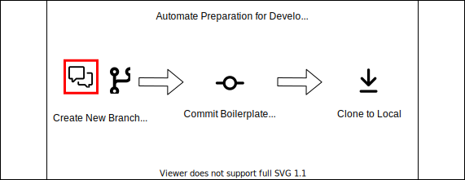
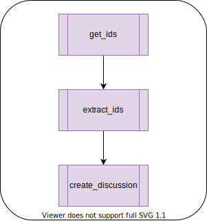

--8<-- "includes/abbreviations.md"

<div id="banner" class="page-image">
    
    <div class="page-image-caption">
        <p>
            <a href="">AUTHOR</a>
        </p>
    </div>
</div>

<!-- Reposition the banner image on top -->
<script>
    var article = document.getElementsByTagName("article")[0];
    article.insertBefore(document.getElementById("banner"), article.childNodes[0]);
</script>

# Hello, GitHub Discussions! Goodbye, Disqus...

*Posted by [Jason Bolden](../about.md) on Nov 02, 2021*


In short, I don't like the free version of Disqus. Ads serve a purpose in this world, and they often allow us to enjoy a lot of valuable content at the cost of a portion of our attention. However, I don't want them on my blog. Instead, let's leverage some of the native functionality of GitHub and create a Discussion thread when a new post is published to the blog; all automated, of course.

## Objective
Referencing the previous post on [Documentation Automation](./2021-07-17-automating-docs-as-code.html), we intend to make a minor change to the existing flow. The reason why one would want to do this is to further consolidate the developer experience by adding a forum for collaborative communication linked to published content within the project.

<figure>
  
  <figcaption>Figure 1 - Conceptual Flow</figcaption>
</figure>

## The Breakdown
We'll start by explaining all the pieces necessary to add the new automation steps and tie them all together in the end.

### GitHub Discussions GraphQL API
GitHub recently released their [GraphQL API for Discussions](https://docs.github.com/en/graphql/guides/using-the-graphql-api-for-discussions). For our workflow, we want to create a new Discussion when a new Blog Post issue is assigned. To figure out how to programmatically do this, let's reference the docs and leverage the [GitHub GraphQL Explorer](https://docs.github.com/en/graphql/overview/explorer).

<figure>
  
  <figcaption>Figure 2 - GitHub GraphQL Explorer</figcaption>
</figure>

The details behind GraphQL fall outside the scope of this post; however GitHub provides a nice [overview](https://docs.github.com/en/graphql/guides/introduction-to-graphql) on their docs site. The calls we need to perform are as follows:

1. `query` for the repositoryId and categoryId we want to assign the new discussion
2. `mutation` to create the new discussion

<figure>
  
  <figcaption>Figure 3 - GraphQL DiscussionCategories Query</figcaption>
</figure>

```graphql hl_lines="2 5 6"
query DiscussionCategory {
    repository(name: "profile", owner: "jbold569") {
        discussionCategories(first: 10) {
            nodes {
                name
                id
            }
        }
        id
    }
}
```

```json
{
    "data": {
        "repository": {
            "discussionCategories": {
                "nodes": [
                {
                    "name": "Announcements",
                    "id": "DIC_kwDOFjAb884B_pJC"
                },
                {
                    "name": "General",
                    "id": "DIC_kwDOFjAb884B_pJD"
                },
                {
                    "name": "Q&A",
                    "id": "DIC_kwDOFjAb884B_pJE"
                },
                {
                    "name": "Ideas",
                    "id": "DIC_kwDOFjAb884B_pJF"
                },
                {
                    "name": "Show and tell",
                    "id": "DIC_kwDOFjAb884B_pJG"
                },
                {
                    "name": "Polls",
                    "id": "DIC_kwDOFjAb884B_pJH"
                },
                {
                    "name": "Blog",
                    "id": "DIC_kwDOFjAb884B_pOx"
                }
                ]
            },
            "id": "MDEwOlJlcG9zaXRvcnkzNzIyNTE2MzU="
        }
    }
}
```

The GraphQL explorer returns a JSON payload with information required for the next step. Without this step, The Mutation call wouldn't know which repository to create the new Discussion in nor what category to assign it.

```graphql hl_lines="3 5"
mutation CreateDiscussion {
  __typename
  createDiscussion(input: {repositoryId: "MDEwOlJlcG9zaXRvcnkzNzIyNTE2MzU=", title: "Explorer Test", body: "This is a discussion made via the GraphQL Explorer!", categoryId: "DIC_kwDOFjAb884B_pOx", clientMutationId: ""}) {
    discussion {
      number
    }
  }
}
```

```json
{
  "data": {
    "__typename": "Mutation",
    "createDiscussion": {
      "discussion": {
        "number": 15
      }
    }
  }
}
```

<figure>
  
  <figcaption>Figure 4 - Discussion created with GraphQL</figcaption>
</figure>

!!! Attention
    On line 5 of the mutation snippet, we specified to return the value of the `number` field for the new discussion. Having the discussion number will be useful in a later enhancement to this flow. I'll expand more on this at the conclusion of this post.

### GitHub GraphQL Action
Now that we've establish what API calls we need to make the discussion and tested them manually, let's build out the automation to add this to our pipeline. The steps we want to inject into our workflow are as follows:

<figure>
  
  <figcaption>Figure 6 - New action steps</figcaption>
</figure>

[Octokit](https://docs.github.com/en/rest/overview/libraries) maintains a repo, [graphql-action](https://github.com/octokit/graphql-action), that allows you to make calls to the GitHub GraphQL API via a GitHub Action. At this time, it's limited to only GraphQL queries, so we'll also explore how to make calls using cURL for the mutation portion.

```yaml hl_lines="6 17 18"
- name: Query GraphQL for Ids
  uses: octokit/graphql-action@v2.x
  id: get_ids
  with:
    query: |
      query ids($owner:String!,$repo:String!) { 
        repository(owner:$owner,name:$repo) {
          discussionCategories(first: 10) {
            nodes {
              name
              id
            }
          }
          id
        }
      }
    owner: ${{ github.event.repository.owner.login }}
    repo: ${{ github.event.repository.name }}
  env:
    GITHUB_TOKEN: ${{ secrets.GITHUB_TOKEN }}
```

The `octokit/graphql-action` allows us to basically copy/paste the query we developed in the explorer with the exception of defining the variables and their types being passed to the query; similar to a function definition. Lines 17 and 18 pull the repository name and owner login from the action event object rather than hardcoded values seen previously.


!!! Attention
    The `octokit/graphql-action` documentation references the use of `github.event.repository.owner.name`. That value is not present in the webhook event [payload object](https://docs.github.com/en/developers/webhooks-and-events/webhooks/webhook-events-and-payloads#webhook-payload-object-common-properties). It should be `github.event.repository.owner.login`

The question now is, how do we pull the Id's from the json returned by the initial query? Introducing, [jq](https://stedolan.github.io/jq/). `jq` is a handy command-line utility that makes processing JSON a easier. We're going to use it to extract the Id's and assign them to [environment variables](https://docs.github.com/en/actions/learn-github-actions/workflow-commands-for-github-actions#setting-an-environment-variable) for our next workflow step.

<figure>
  
  <figcaption>Figure 5 - jqplay query builder output</figcaption>
</figure>

```yaml hl_lines="6 7"
- name: Extract Ids
  id: extract_ids
  env:
    JSON_DATA: ${{ steps.get_ids.outputs.data}}
  run: >
    echo "repositoryId=$(echo ${JSON_DATA} | jq '.repository.id')" >> $GITHUB_ENV
    echo "categoryId=$(echo ${JSON_DATA} | jq '.repository.discussionCategories.nodes[] | select(.name == "Blog") | .id')" >> $GITHUB_ENV
```

At the time of writing, the `octokit/graphql-action` action did not support mutations 😢. Luckily there's a fallback. The GitHub GraphQL API can be queried using [http requests](https://docs.github.com/en/github-ae@latest/graphql/guides/forming-calls-with-graphql#communicating-with-graphql). Knowing this, we can instead form a JSON payload containing our mutation statement and send it via cURL. It's messy (lots of debugging escape-characters), but it gets the job done.

```yaml
- name: Create Discussion cURL
  id: create_discussion
  run: |
    curl -H "Authorization: bearer ${{env.GITHUB_TOKEN }}" -X POST -d " \
    { \
    \"query\": \"mutation { createDiscussion(input: {repositoryId: \\\"${{ env.repositoryId }}\\\", title: \\\"${{ env.title }}\\\", body: \\\"${{ env.body }}\\\", categoryId: \\\"${{ env.categoryId }}\\\"}) { discussion { number } } }\" \
    } \
    " https://api.github.com/graphql
    
  env:
    GITHUB_TOKEN: ${{ secrets.GITHUB_TOKEN }}
    title: ${{ github.event.issue.title }}
    body: "This discussion was made by GitHub Actions"
```

<figure>
  
  <figcaption>Figure 6 - Discussion create by the 3 new action steps</figcaption>
</figure>

## Conclusion
We'll stop here for the scope of this post. There are some other things that could be added to further enhance the automation:

- Inject the url to the new discussion in the `profile_builder` module so it can be added to the new blog post template automatically. Discussions urls match the pattern: `/<owner>/<repository>/discussions/<discussion_number>` (recall that we purposefully captured that number after the mutation call)
- Programmatically add the link to the new Blog Post to the Discussion Body. 
- Assign different discussion categories or use a different body template based on issue labels

Let's take a look at the bigger picture for a second. [Discussions](https://youtu.be/IpBw2SJkFyk) were created to facilitate collaborative communication about a project. Assuming you're a maintainer for a project on GitHub and you have a project site for publishing posts, tying these posts to a discussion just makes sense if you value community around your product. The bonus here being, Discussions are built into the GitHub ecosystem and are tied directly to your project. Fewer dependencies, less context switching, it's awesome! 


## References

- [GitHub GraphQL API for Discussions](https://docs.github.com/en/graphql/guides/using-the-graphql-api-for-discussions)
- [GitHub GraphQL Intro](https://docs.github.com/en/graphql/guides/introduction-to-graphql)
- [jq](https://jqplay.org/)
- [GitHub Webhook Events and Payloads](https://docs.github.com/en/developers/webhooks-and-events/webhooks/webhook-events-and-payloads)
- [GitHub GraphQL cURL](https://docs.github.com/en/github-ae@latest/graphql/guides/forming-calls-with-graphql#communicating-with-graphql)

## Comment
Continue the discussion [here](https://github.com/jbold569/profile/discussions/19)!
