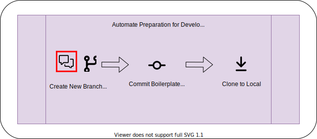

--8<-- "includes/abbreviations.md"

<div id="banner" class="page-image">
    
    <div class="page-image-caption">
        <p>
            <a href="">AUTHOR</a>
        </p>
    </div>
</div>

<!-- Reposition the banner image on top -->
<script>
    var article = document.getElementsByTagName("article")[0];
    article.insertBefore(document.getElementById("banner"), article.childNodes[0]);
</script>

# Hello, GitHub Discussions! Goodbye, Disqus...

*Posted by [Jason Bolden](../about.md) on Nov 02, 2021*


In short, I don't like the free version of Disqus. ADs serve a purpose in this world, and they often allow us to enjoy a lot of valuable content at the cost of a portion of our attention. However, I don't want them on my blog. Instead, let's leverage some of the native functionality of GitHub and create a Discussion thread when a new post is published to the blog; all automated, of course.

## Objective
Referencing the previous post on [Documentation Automation](./2021-07-17-automating-docs-as-code.html), we intend to make a minor change to the existing flow. The reason why one would want to do this is to further consolidate the developer experience and make our repo a one-stop shop for all things concerning the project.

<figure>
  
  <figcaption>Figure 1 - Conceptual Flow</figcaption>
</figure>

## The Breakdown
We'll look at all the pieces necessary to add the new automation steps and tie them all together in the end.

### GitHub Discussions GraphQL API
GitHub recently released their [GraphQL API for Discussions](https://docs.github.com/en/graphql/guides/using-the-graphql-api-for-discussions). For our work flow, we want to create a new Discussion when a new Blog Post issue is assigned. To figure out how to programmatically do this, let's reference the docs and leverage the [GitHub GraphQL Explorer](https://docs.github.com/en/graphql/overview/explorer).

<figure>
  
  <figcaption>Figure 2 - GitHub GraphQL Explorer</figcaption>
</figure>

The details behind GraphQL fall outside the scope of this post; however GitHub provides a nice [overview](https://docs.github.com/en/graphql/guides/introduction-to-graphql) on their docs site. The calls we need to perform are as follows:

1. `query` for the repositoryId and categoryId we want to assign the new discussion
2. `mutation` to create the new discussion

<figure>
  
  <figcaption>Figure 3 - GraphQL DiscussionCategories Query</figcaption>
</figure>

```graphql hl_lines="2-4 8"
query DiscussionCategory {
  repository(name: "profile", owner: "jbold569") {
    discussionCategories(first: 10) {
      nodes {
        name
        id
      }
    }
    id
  }
}
```

```json
{
  "data": {
    "repository": {
      "discussionCategories": {
        "nodes": [
          {
            "name": "Announcements",
            "id": "DIC_kwDOFjAb884B_pJC"
          },
          {
            "name": "General",
            "id": "DIC_kwDOFjAb884B_pJD"
          },
          {
            "name": "Q&A",
            "id": "DIC_kwDOFjAb884B_pJE"
          },
          {
            "name": "Ideas",
            "id": "DIC_kwDOFjAb884B_pJF"
          },
          {
            "name": "Show and tell",
            "id": "DIC_kwDOFjAb884B_pJG"
          },
          {
            "name": "Polls",
            "id": "DIC_kwDOFjAb884B_pJH"
          },
          {
            "name": "Blog",
            "id": "DIC_kwDOFjAb884B_pOx"
          }
        ]
      },
      "id": "MDEwOlJlcG9zaXRvcnkzNzIyNTE2MzU="
    }
  }
}
```
```graphql
mutation CreateDiscussion {
  __typename
  createDiscussion(input: {repositoryId: "MDEwOlJlcG9zaXRvcnkzNzIyNTE2MzU=", title: "Explorer Test", body: "This is a discussion made via the GraphQL Explorer!", categoryId: "DIC_kwDOFjAb884B_pOx", clientMutationId: ""}) {
    discussion {
      number
    }
  }
}
```
```json
{
  "data": {
    "__typename": "Mutation",
    "createDiscussion": {
      "discussion": {
        "number": 15
      }
    }
  }
}
```

<figure>
  
  <figcaption>Figure 4 - Discussion created with GraphQL</figcaption>
</figure>

!!! Attention
    Adding the discussion number will be useful in a later enhancement to this flow. I'll expand more on this at the conclusion of this post.

### GitHub GraphQL Action
Now that we've establish what API calls we need to make the discussion and tested them manually, let's begin building out the automation to add this to our pipeline. [Octokit](https://docs.github.com/en/rest/overview/libraries) maintains a repo, [graphql-action](https://github.com/octokit/graphql-action), that allows you to make calls to the GitHub GraphQL API via a GitHub Action.

```yaml
- name: Query GraphQL for Ids
  uses: octokit/graphql-action@v2.x
  id: get_ids
  with:
    query: |
    query ids($owner:String!,$repo:String!) { 
        repository(owner:$owner,name:$repo) {
        discussionCategories(first: 10) {
            nodes {
            name
            id
            }
        }
        id
        }
    }
    owner: ${{ github.event.repository.owner.login }}
    repo: ${{ github.event.repository.name }}
  env:
    GITHUB_TOKEN: ${{ secrets.GITHUB_TOKEN }}
```

```yaml
- name: Create Discussion cURL
  id: create_discussion
  run: |
    curl -H "Authorization: bearer ${{env.GITHUB_TOKEN }}" -X POST -d " \
    { \
    \"query\": \"mutation { createDiscussion(input: {repositoryId: \\\"${{ env.repository_id }}\\\", title: \\\"${{ env.title }}\\\", body: \\\"${{ env.body }}\\\", categoryId: \\\"${{ env.category_id }}\\\"}) { discussion { number } } }\" \
    } \
    " https://api.github.com/graphql
    
  env:
    GITHUB_TOKEN: ${{ secrets.GITHUB_TOKEN }}
    repository_id: ${{ env.repositoryId }}
    title: ${{ github.event.issue.title }}
    body: "This discussion was made by GitHub Actions"
    category_id: ${{ env.categoryId }}
```

The question now is, how do we pull the Id's from the json returned by the initial query? Introducing, jq

```yaml
- name: Extract Ids
  env:
    JSON_DATA: ${{ steps.get_ids.outputs.data}}
  run: >
    echo "repositoryId=$(echo ${JSON_DATA} | jq '.repository.id')" >> $GITHUB_ENV
    echo "categoryId=$(echo ${JSON_DATA} | jq '.repository.discussionCategories.nodes[] | select(.name == "Blog") | .id')" >> $GITHUB_ENV
```

<figure>
  
  <figcaption>Figure 5 - jqplay query builder output</figcaption>
</figure>

!!! Attention
    github.event.repository.owner.login!!!!


<figure>
  
  <figcaption>Figure 6 - Discussion create by the 3 new action steps</figcaption>
</figure>

## Conclusion
## References

https://docs.github.com/en/graphql/guides/using-the-graphql-api-for-discussions
https://docs.github.com/en/graphql/guides/introduction-to-graphql
https://jqplay.org/
https://docs.github.com/en/developers/webhooks-and-events/webhooks

## Comment
Continue the discussion [here]()
# Cheatsheet
## [Admonitions](https://squidfunk.github.io/mkdocs-material/reference/admonitions/#supported-types)
!!! note
    Lorem ipsum dolor sit amet, consectetur adipiscing elit. Nulla et euismod
    nulla. Curabitur feugiat, tortor non consequat finibus, justo purus auctor
    massa, nec semper lorem quam in massa.

??? note
    Lorem ipsum dolor sit amet, consectetur adipiscing elit. Nulla et euismod
    nulla. Curabitur feugiat, tortor non consequat finibus, justo purus auctor
    massa, nec semper lorem quam in massa.

!!! note ""
    Lorem ipsum dolor sit amet, consectetur adipiscing elit. Nulla et euismod
    nulla. Curabitur feugiat, tortor non consequat finibus, justo purus auctor
    massa, nec semper lorem quam in massa.

!!! note "Other Title"
    Lorem ipsum dolor sit amet, consectetur adipiscing elit. Nulla et euismod
    nulla. Curabitur feugiat, tortor non consequat finibus, justo purus auctor
    massa, nec semper lorem quam in massa.

!!! note
    Lorem ipsum dolor sit amet, consectetur adipiscing elit. Nulla et euismod
    nulla. Curabitur feugiat, tortor non 
    
    ```python
        import re
        print("Hello World!")
    ```

    consequat finibus, justo purus auctor
    massa, nec semper lorem quam in massa.